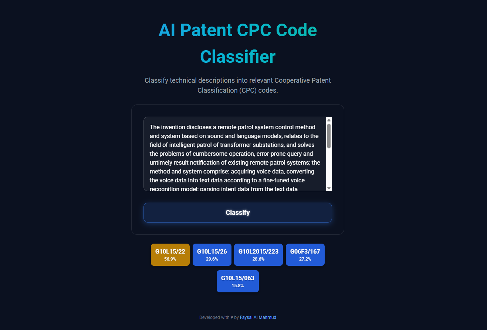

<h1 align="center">AI Patent CPC Code Classifier </h1>

A **multi-label text classification** to predict **Cooperative Patent Classification (CPC)** codes from patent abstracts. Built using **Hugging Face Transformers**, **fastai**, and **Blurr**, this covers the full pipeline—from scraping patent data to model training, optimization, and deployment via **Hugging Face Spaces** and **Render**.


---

## 🧠 Overview

The **AI Patent CPC Code Classifier** predicts multiple CPC codes for a given patent abstract, enabling structured classification of inventions. It leverages **roberta-base**, **bert-base-uncased**, and **distilroberta-base**, fine-tuned using **fastai + Blurr**, and supports **model compression and fast inference via ONNX**.

**Key Highlights:**

* End-to-end pipeline for **multi-label patent classification**
* Three transformer models trained: **roberta-base**, **bert-base-uncased**, **distilroberta-base**
* **ONNX quantization** for efficient inference
* **Gradio app** deployed on Hugging Face Spaces
* **Flask app** deployed on Render using Hugging Face API

---

## 📂 Data Collection & Preprocessing

**Workflow:**

1. Download CSV files per search query containing patent URLs.
2. Scrape each patent to extract: *Publication Number*, *Title*, *Abstract*, and *CPC Codes*.
3. Raw data: **39,681 records** → Processed dataset: **32,172 records**.
4. After drop duplicates & missing values, **32,172 records** remained.
5. Initially, **28,021 CPC codes** were identified. After removing **27,892 rare CPC codes** (less than 0.01% of total records), the final dataset contained **129 unique CPC codes**, which were used for model prediction.
**Data used for model training:** only *abstracts* and *CPC codes*.

**Search Queries:**

| AI & ML Topics                        |                                |                                |
| ------------------------------------- | ------------------------------ | ------------------------------ |
| Transformer Language Model            | Federated Learning Privacy     | Reinforcement Learning Policy  |
| Generative Diffusion Model            | Neural Network Compression     | Explainable AI System          |
| Computer Vision Segmentation          | Anomaly Detection Time Series  | Natural Language Understanding |
| Active Learning Data Selection        | Edge AI Accelerator            | Transfer Learning Pre-trained  |
| Model Drift Monitoring                | Graph Neural Network Embedding | Causal Inference AI            |
| Hyperparameter Optimization Automated | Synthetic Data Generation      | Adversarial Machine Learning   |
| Deep Learning Compiler                | Model Deployment Pipeline      | -                              |

**CPC Code Format:** `[Section][Class][Subclass][MainGroup]/[Subgroup]`

**Examples:**

* `G06N20/00` — Machine learning
* `G06N3/045` — Combinations of networks

-Data scraped from [Google Patents](https://patents.google.com/) using `Selenium` <br>
-Cleaned dataset saved at `data/processed/processed_patent_details.csv` <br>
-Raw data stored under `data/downloads_patent_urls/` and `data/scraped/`


---

## 🏗️ Model Training & Evaluation

Three transformer models were trained for **multi-label patent CPC classification**:

* **roberta-base**
* **bert-base-uncased**
* **distilroberta-base**

**Why Blurr?**

* Simplifies transformer training within fastai
* Seamless Hugging Face integration
* Efficient support for multi-label classification

**Evaluation Metrics:**

| Model                          | Micro F1 | Macro F1 |  Size  |
| ------------------------------ | :------: | :------: | :----: |
| distilroberta-base             |   0.217  |   0.063  | 315.8 MB |
| distilroberta-base (quantized) |   0.222  |   0.065  |  81.3 MB |
| roberta-base                   |   0.281  |   0.136  | 478.1 MB |
| roberta-base (quantized)       |   0.273  |   0.123  | 124.4 MB |
| bert-base-uncased              |   0.234  |   0.081  | 419.1 MB |
| bert-base-uncased (quantized)  |   0.124  |   0.054  | 109.9 MB |

*(Update metrics after final evaluation)*

**Model Selection:** The model `distilroberta-base (quantized)` with the **Better F1-score and for faster inference** was chosen for deployment, with **ONNX used for compression and fast inference**.

---

## 📦 Deployment

The deployment section is placed immediately after model training. The project includes **two deployment options**:

**1. Gradio App:**
<br>

* Located in the `deployment/` folder.
* Hosted on **Hugging Face Spaces** for interactive use.
* Users can input patent abstracts and get predicted CPC codes.
* Link: [Gradio App](https://faysalalmahmud-ai-patent-cpc-code-classifier.hf.space/)

<br>

**2. Flask App (Render):**
<br>

* Located in the `docs/` folder.
* Uses the selected transformer model via **Hugging Face API**.
* Hosted on **Render** for web access and integration.
* Link: [Flask App](https://ai-patent-cpc-code-classifier.onrender.com)

---

## ⚙️ Installation

```bash
git clone https://github.com/faysalalmahmud/ai-patent-cpc-code-classifier.git
cd ai-patent-cpc-code-classifier
python -m venv venv
source venv/bin/activate  # Windows: venv\Scripts\activate
pip install -r requirements.txt
```

---

## 🛠️ Technologies

**ML & NLP:** PyTorch, Hugging Face Transformers, fastai, Blurr, ONNX Runtime
**Data Processing:** Pandas, NumPy, Selenium
**Deployment & Hosting:** Hugging Face, Render
**Tools:** Jupyter Notebook, Git

---

## 📦 Project Structure

```
ai-patent-cpc-code-classifier/
│
├── data/
│   ├── downloads_patent_urls/
│   │   ├── gp-search-20251001-102339.csv
│   │   ├── gp-search-20251001-102354.csv
│   │   ├── gp-search-20251001-102414.csv
│   │   ├── gp-search-20251001-102423.csv
│   │   ├── gp-search-20251001-102444.csv
│   │   ├── gp-search-20251001-102500.csv
│   │   ├── gp-search-20251001-102516.csv
│   │   ├── gp-search-20251001-102533.csv
│   │   ├── gp-search-20251001-102549.csv
│   │   ├── gp-search-20251001-102606.csv
│   │   ├── gp-search-20251001-102619.csv
│   │   ├── gp-search-20251001-102636.csv
│   │   ├── gp-search-20251001-102651.csv
│   │   ├── gp-search-20251001-102706.csv
│   │   ├── gp-search-20251001-102718.csv
│   │   ├── gp-search-20251001-102736.csv
│   │   ├── gp-search-20251001-102758.csv
│   │   ├── gp-search-20251001-102808.csv
│   │   ├── gp-search-20251001-102824.csv
│   │   └── gp-search-20251001-102842.csv
│   ├── processed/
│   │   └── processed_patent_details.csv
│   │
│   └── scraped/
│       ├── patent_details_20251001-102339.csv
│       ├── patent_details_20251001-102354.csv
│       ├── patent_details_20251001-102414.csv
│       ├── patent_details_20251001-102423.csv
│       ├── patent_details_20251001-102444.csv
│       ├── patent_details_20251001-102500.csv
│       ├── patent_details_20251001-102516.csv
│       ├── patent_details_20251001-102533.csv
│       ├── patent_details_20251001-102549.csv
│       ├── patent_details_20251001-102606.csv
│       ├── patent_details_20251001-102619.csv
│       ├── patent_details_20251001-102636.csv
│       ├── patent_details_20251001-102651.csv
│       ├── patent_details_20251001-102706.csv
│       ├── patent_details_20251001-102718.csv
│       ├── patent_details_20251001-102736.csv
│       ├── patent_details_20251001-102758.csv
│       ├── patent_details_20251001-102808.csv
│       ├── patent_details_20251001-102824.csv
│       └── patent_details_20251001-102842.csv
├── dataloaders/
│   └── README.md
├── deployment/
│   ├── app.py
│   ├── distilroberta-base-patent-cpc-classifier-quantized.onnx
│   ├── encode_revised_cpc_codes.json
│   ├── huggingface screenshot.png
│   ├── README.md
│   └── requirements.txt
├── docs/
│   ├── templates/
│   │   └── index.html
│   ├── app.py
│   ├── Procfile
│   └── requirements.txt
├── models/
│   └── README.md
├── src/
│   ├── onnx_inference.ipynb
│   ├── patent_cpc_code_classifer.ipynb
│   ├── patent_details_scraper.py
│   ├── patent_urls_scraper.py
│   └── process_data.py
├── .gitignore
├── LICENSE
└── README.md
```

---

## 🤝 Contributing

1. Fork the repository
2. Create a branch (`feature/your-feature`)
3. Commit changes and push
4. Submit a Pull Request

*Contributions welcome:* accuracy improvements, scraping extensions, better visualizations

---

## 📜 License

MIT License — see [LICENSE](LICENSE)

---

## 👤 Author

**Faysal Al Mahmud**
GitHub: [@faysalalmahmud](https://github.com/faysalalmahmud)
Email: [faysalalmahmud78@gmail.com](mailto:faysalalmahmud78@gmail.com)

---

### Acknowledgments

* [Google Patents](https://patents.google.com/)
* CPC system by USPTO & EPO
* Hugging Face, fastai, and Blurr teams
* Open-source ML community
